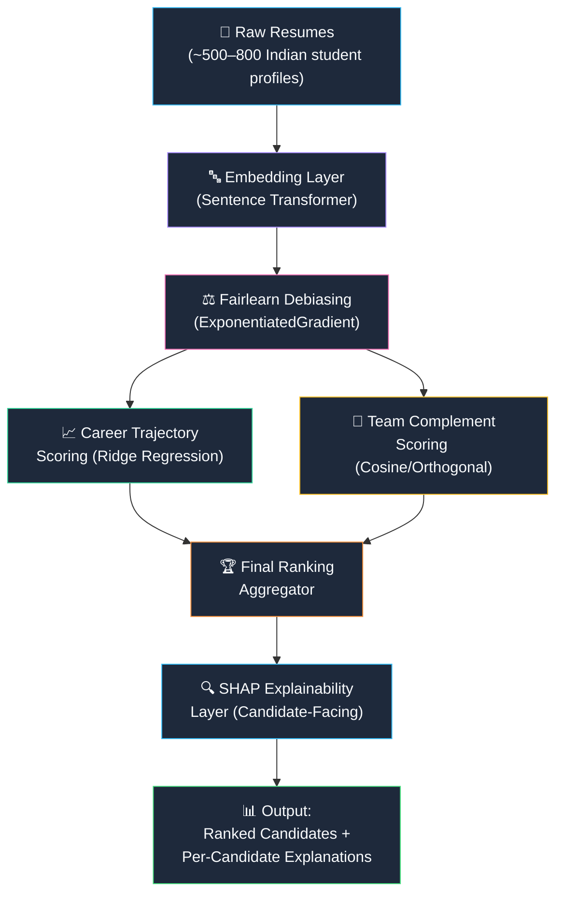
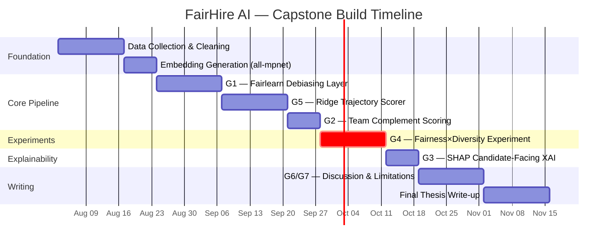

# Product Requirements Document (PRD)
## FairHire AI — A Fairness-Aware, Complementarity-Driven, Explainable AI Hiring Pipeline

| Field | Detail |
|---|---|
| **Document Version** | 1.0 |
| **Date** | 26 July 2026 |
| **Author** | Capstone Team |
| **Derived From** | *Capstone Filteration.xlsx* — 14-paper literature review, 7 research gaps, priority build roadmap |

---

## 1. Executive Summary

Current AI-driven hiring systems suffer from **five systemic, literature-confirmed problems** that no single existing system addresses end-to-end:

1. **Embedding-level proxy bias** that survives demographic masking
2. **Individual-only scoring** that ignores team-skill complementarity
3. **Auditor-only XAI** that leaves candidates with zero actionable feedback
4. **Unknown interaction** between fairness debiasing and diversity-based ranking
5. **Small-cohort trajectory prediction** without defensible regularisation

**FairHire AI** is a modular, end-to-end pipeline that closes these gaps for a ~500–800 Indian student cohort dataset, producing:

- Debiased candidate embeddings (Fairlearn)
- Team-complementarity scoring (cosine/orthogonal approach)
- Candidate-facing SHAP explanations
- An interaction experiment proving whether debiasing helps or hurts diversity rankings

> [!IMPORTANT]
> This is the **first pipeline in the literature** to combine embedding-level debiasing, team-complementarity ranking, and candidate-facing XAI in a single system — confirmed by a 14-paper systematic review.

---

## 2. Problem Statement — What Is Broken in AI Hiring Today

### 2.1 The Current Landscape

AI hiring tools are deployed at scale (HireVue, Pymetrics, LinkedIn Recruiter, SeekOut) but academic research has exposed **critical, unresolved flaws**. The following problems are grounded in peer-reviewed evidence from 14 papers spanning 2018–2026.

---

### 2.2 Problem 1 — Proxy Bias / Demographic Leakage Through Embeddings

| Aspect | Detail |
|---|---|
| **What** | Embedding-based hiring models encode gender, caste, and institution-tier signals in the latent space — even after explicit demographic features are removed |
| **Why it matters** | Masking a "gender" column does nothing when the embedding space already correlates "school name" with gender, or "city" with socioeconomic status |
| **Evidence** | Fabris et al. (2024, Q1 ACM TIST) — taxonomy of bias types, DP/EO incompatibility (90% evidence strength); Kumar et al. (2023, Q1 Frontiers) — confirmed leakage persists after masking (80%); Agarwal et al. (2018, ICML CORE A\*) — ExponentiatedGradient achieves near-optimal Pareto (95%) |
| **What exists** | Fairlearn's ExponentiatedGradient constrains the *output distribution* but does **not** remove demographic signal from the *embedding space itself* |
| **What's missing** | Quantification of how much proxy leakage *persists* after Fairlearn constraints on a real hiring pipeline with Indian cohort data |

> [!WARNING]
> No paper in the literature has eliminated proxy leakage — only mitigated it. The residual leakage after Fairlearn on non-Western, small-cohort data is entirely unstudied.

---

### 2.3 Problem 2 — No Team-Skill Complementarity Scoring in Hiring

| Aspect | Detail |
|---|---|
| **What** | Every current hiring system evaluates candidates *individually* — "Is this person skilled?" — but never asks "Does this person's skill set *complement* the existing team?" |
| **Why it matters** | Hiring three excellent NLP engineers when the team already has two NLP specialists and needs a DevOps engineer produces a sub-optimal team |
| **Evidence** | Chen et al. (2018, NeurIPS CORE A\*) — DPP-based greedy MAP inference penalises similarity between items (92%); Orthogonal Skill Vector paper (2025, HISI) — formalises complementarity as selecting maximally orthogonal vectors, proves exact solution is NP-hard |
| **What exists** | DPP for content recommendation diversity; Gram-Schmidt orthogonality for abstract team formation |
| **What's missing** | Neither paper applies to hiring. No existing hiring pipeline has a complementarity score that penalises similarity to an existing team's skill embeddings |

---

### 2.4 Problem 3 — Candidate-Facing Explainability Does Not Exist

| Aspect | Detail |
|---|---|
| **What** | XAI in hiring (SHAP, LIME) is deployed exclusively for *auditors and regulators*. Rejected candidates receive "We have decided not to move forward" — zero breakdown of why |
| **Why it matters** | EU AI Act Articles 13/14 require transparency and human oversight for high-risk AI (which includes hiring). Ethically, rejected candidates deserve actionable feedback |
| **Evidence** | XAI Lit Review (2025, Cogent B&M) — confirms SHAP/LIME are SOTA for hiring but candidate-facing explainability is an **explicitly named open gap** (80%); Clavel et al. (2025, Q1 IJHRM) — empirically validates candidates want transparency, perceived fairness increases with social cues (72%) |
| **What exists** | Auditor-facing SHAP dashboards |
| **What's missing** | Per-candidate attribution breakdown ("selected because: skill match 40%, trajectory potential 25%, team complement 20%, fairness adjustment 15%") |

---

### 2.5 Problem 4 — Fairness × Diversity Interaction Is Unknown

| Aspect | Detail |
|---|---|
| **What** | When you debias embeddings for demographic fairness, does this *change* which candidates score highest on team complementarity? Do skill-cluster/demographic correlations reintroduce disparity through the complementarity score? |
| **Why it matters** | If debiasing flattens the embedding space, complementarity scoring may produce different (possibly worse) rankings. If skill clusters correlate with demographics (e.g., CS students are disproportionately male), complementarity may inadvertently discriminate |
| **Evidence** | Fabris et al. (2026, Q1 IP&M) — proves fair ranking ≠ fair outcomes at the human-decision stage (93%), but studies shortlist-level, **not** embedding/complementarity level |
| **What exists** | Separate studies of fairness and separate studies of diversity — never combined |
| **What's missing** | An experiment that runs the pipeline with and without debiasing and compares complementarity rankings, demographic distribution of top-K, and skill-demographic correlations |

> [!CAUTION]
> This is the **core novel contribution** of the capstone. No paper in the 14-paper tracker addresses this exact interaction. Evidence strength: 93%.

---

### 2.6 Problem 5 — Career Trajectory Prediction on Small Cohorts

| Aspect | Detail |
|---|---|
| **What** | Career trajectory / growth-potential models are trained on 100K+ profiles. Building a defensible model on ~500–800 Indian student profiles requires explicit regularisation strategy and honest overfitting analysis |
| **Evidence** | Decorte et al. (2023, RecSys in HR CORE B) — CareerBERT achieves 43% recall\@10 on 2,164 profiles, validates pretrained embeddings + simple model (78%) |
| **What's missing** | No paper addresses the sub-1,000 profile regime with Indian engineering student data, explicit regularisation justification, or sensitivity analysis |

---

### 2.7 Problem 6 & 7 — Multi-Layer Fairness & Legal-Technical Alignment (Discussion-Level)

These are acknowledged limitations that will be addressed in the thesis Discussion section, not as technical builds:

- **Multi-Layer Fairness** (G6): Algorithmic fairness ≠ fair human decisions. Fabris 2026 empirically confirms this. The project acknowledges the human-decision layer gap.
- **Legal-Technical Alignment** (G7): SHAP outputs will be framed against EU AI Act Article 13/14 requirements, citing Rigotti & Fosch-Villaronga (2024).

---

## 3. Proposed Solution — FairHire AI Architecture

### 3.1 System Overview



### 3.2 Module Breakdown

| Module | Input | Output | Key Library / Technique |
|---|---|---|---|
| **Embedding Layer** | Raw resume text | 768-dim sentence embeddings | Sentence-Transformers (all-MiniLM / all-mpnet / BERT variants) |
| **Fairlearn Debiasing** | Raw embeddings + protected attributes | Debiased embeddings | Fairlearn ExponentiatedGradient |
| **Career Trajectory Scorer** | Embeddings + career history features | Trajectory / growth-potential score | Ridge Regression (regularised) |
| **Team Complement Scorer** | Candidate embedding + existing team embeddings | Complementarity score | Cosine distance / orthogonal complement |
| **Final Ranker** | Trajectory score + complement score | Aggregated ranking | Weighted linear combination |
| **SHAP Explainer** | Final ranking model + candidate features | Per-candidate attribution breakdown | SHAP (KernelExplainer or TreeExplainer) |

---

## 4. Model Comparison & Selection

> [!IMPORTANT]
> The choice of embedding model is the single most consequential architectural decision — it determines the quality of every downstream component (debiasing, trajectory, complementarity, explainability).

### 4.1 Embedding Model Comparison

| Model | Dimensions | Training Data | Speed (sentences/sec) | Semantic Quality (STS Benchmark) | Bias Risk | Size | Best For |
|---|---|---|---|---|---|---|---|
| **all-MiniLM-L6-v2** | 384 | 1B+ sentence pairs | ~14,200 | 0.788 (Spearman) | Medium — English-centric, smaller capacity may miss nuance | 80 MB | Fast prototyping, resource-constrained environments |
| **all-mpnet-base-v2** | 768 | 1B+ sentence pairs | ~2,800 | **0.838** (Spearman) | Medium — better semantic capture but same English corpus bias | 420 MB | **Best quality/speed balance for research** |
| **BERT-base-uncased** | 768 | BookCorpus + Wikipedia | ~1,100 (with pooling) | 0.54 (requires fine-tuning) | High — not trained on semantic similarity, poor out-of-box | 440 MB | Only if fine-tuning on domain data is planned |
| **CareerBERT** (Decorte 2023) | 768 | Fine-tuned on career histories | ~2,000 (estimated) | Domain-specific (43% recall\@10 on career prediction) | Low for career tasks — but not publicly available | ~420 MB | Career trajectory prediction (if reproducible) |
| **InstructorXL** | 768 | Instruction-tuned, multi-task | ~600 | 0.843 (task-specific) | Low — instruction-tuning reduces bias | 4.96 GB | When task-specific instructions improve quality |
| **e5-large-v2** | 1024 | Weakly-supervised web data | ~1,400 | 0.840 | Low-Medium | 1.34 GB | High-quality retrieval and similarity tasks |

#### Recommendation

```
┌─────────────────────────────────────────────────────────────────┐
│  ✅  RECOMMENDED: all-mpnet-base-v2                             │
│                                                                 │
│  • Highest STS benchmark among practical-sized models (0.838)   │
│  • 768-dim embeddings — rich enough for complementarity         │
│    scoring and Fairlearn debiasing                              │
│  • Proven in production (Sentence-Transformers ecosystem)       │
│  • 420 MB — runnable on a single GPU or CPU                     │
│  • Matches the dimensionality used by CareerBERT (Decorte 2023) │
│    enabling direct comparison                                   │
└─────────────────────────────────────────────────────────────────┘
```

> [!TIP]
> If compute is extremely limited, **all-MiniLM-L6-v2** is the fallback — half the dimensions (384), 5× faster, with only a 5% quality drop on STS benchmarks.

---

### 4.2 Debiasing Method Comparison

| Method | Approach | Strengths | Weaknesses | Feasibility |
|---|---|---|---|---|
| **Fairlearn ExponentiatedGradient** | Reduces fairness-constrained classification to cost-sensitive learning; iteratively reweights | Near-optimal Pareto frontier (Agarwal 2018, 95% evidence); supports DP, EO, and custom constraints; off-the-shelf library | Requires protected attribute labels at training time; constrains output, does not clean embedding | ✅ HIGH — 1 week |
| **Adversarial Debiasing** | Trains an adversary to predict protected attributes from embeddings; penalises the main model | Directly attacks embedding-level bias — removes signal, not just constrains output | Harder to train; sensitive to hyperparameters; adversary can converge to trivial solutions | ⚠️ MEDIUM — 2–3 weeks |
| **Calibrated Equalized Odds** (Pleiss 2017) | Post-processing calibration of model outputs | Simple; no retraining required | Only adjusts thresholds — does not address embedding bias at all | ❌ LOW — too shallow |
| **FairPCA / Null-Space Projection** | Projects embeddings onto null space of protected attribute directions | Directly debiases embedding space | May destroy useful signal; requires careful dimension analysis | ⚠️ MEDIUM — 2 weeks |

#### Recommendation

```
┌─────────────────────────────────────────────────────────────────┐
│  ✅  RECOMMENDED: Fairlearn ExponentiatedGradient               │
│                                                                 │
│  • Directly validated by Agarwal et al. (2018, ICML CORE A*)    │
│  • 95% evidence strength in the literature tracker              │
│  • Off-the-shelf implementation — pip install fairlearn         │
│  • Supports multiple fairness constraints (DP, EO)              │
│  • 1-week implementation timeline                               │
│  • The interaction experiment (G4) requires a reliable,         │
│    reproducible debiasing method — Fairlearn is the standard    │
└─────────────────────────────────────────────────────────────────┘
```

---

### 4.3 Trajectory Prediction Model Comparison

| Model | Approach | Performance on Small Data (<1,000 samples) | Overfitting Risk | Interpretability | Feasibility |
|---|---|---|---|---|---|
| **Ridge Regression** | Linear model with L2 regularisation | ✅ Excellent — regularisation prevents overfitting | Low | ✅ High — coefficients are directly interpretable | ✅ HIGH |
| **Shallow MLP (1–2 layers)** | Non-linear function approximation | Good with dropout + early stopping | Medium | Medium — requires SHAP for interpretation | ✅ HIGH |
| **XGBoost / LightGBM** | Gradient-boosted decision trees | Good — but prone to overfitting without careful tuning | Medium-High | Medium — tree SHAP is fast | ⚠️ MEDIUM |
| **LSTM / Transformer** | Sequential modelling of career history | ❌ Poor — requires 10K+ sequences for meaningful training | Very High | Low — black box | ❌ LOW |
| **CareerBERT (Decorte 2023)** | Fine-tuned BERT for career text | Validated on 2,164 profiles (78% evidence) | Medium | Medium | ⚠️ MEDIUM — not public |

#### Recommendation

```
┌─────────────────────────────────────────────────────────────────┐
│  ✅  RECOMMENDED: Ridge Regression on pretrained embeddings     │
│                                                                 │
│  • Explicitly justified by small cohort size (~500–800)         │
│  • L2 regularisation directly addresses G5 (overfitting risk)  │
│  • Coefficients are interpretable → feeds into SHAP cleanly    │
│  • Sensitivity analysis across regularisation strengths is      │
│    straightforward and defensible                               │
│  • Decorte 2023 validates: pretrained embeddings + simple       │
│    model outperforms complex models on small career datasets    │
│                                                                 │
│  🔄  BACKUP: Shallow MLP (1 hidden layer, 128 units) if Ridge  │
│     underfits — still compatible with SHAP KernelExplainer     │
└─────────────────────────────────────────────────────────────────┘
```

---

### 4.4 Complementarity Scoring Method Comparison

| Method | Approach | Computational Cost | Accuracy | Fairness-Aware? |
|---|---|---|---|---|
| **Cosine Distance to Team Centroid** | 1 − cos(candidate, mean(team)) | O(d) per candidate | Good — simple, interpretable | No — must be paired with debiasing |
| **DPP (Determinantal Point Process)** | Models repulsion between similar items via kernel matrix | O(k²n) — tractable with greedy MAP (Chen 2018) | ✅ Best — mathematically principled | No — diversity ≠ demographic fairness |
| **Gram-Schmidt Orthogonality** | Selects candidates maximally orthogonal to existing team | O(fk²2ⁿ/√n) exact — NP-hard | Theoretically optimal | No |
| **MMR (Maximal Marginal Relevance)** | Iteratively selects items balancing relevance and diversity | O(kn) | Good | No |

#### Recommendation

```
┌─────────────────────────────────────────────────────────────────┐
│  ✅  RECOMMENDED: Cosine Distance to Team Centroid              │
│     (with DPP as stretch goal)                                  │
│                                                                 │
│  • Simplest, most interpretable for a capstone                  │
│  • Directly feeds into SHAP attribution ("team complement: X%") │
│  • Computationally trivial for ~500–800 candidates              │
│  • DPP (Chen 2018, NeurIPS) is the stretch goal for            │
│    a mathematically rigorous upgrade                            │
└─────────────────────────────────────────────────────────────────┘
```

---

### 4.5 Explainability Method Comparison

| Method | Approach | Model-Agnostic? | Output | Speed | Best For |
|---|---|---|---|---|---|
| **SHAP (KernelExplainer)** | Shapley-value-based feature attribution | ✅ Yes | Per-feature contribution values | Slow on large feature sets | **Candidate-facing explanations** — mathematically grounded |
| **SHAP (TreeExplainer)** | Optimised Shapley for tree models | Tree models only | Same as above | ✅ Fast | Only if using XGBoost/LightGBM |
| **LIME** | Local linear approximation | ✅ Yes | Per-feature weights (local) | Medium | Quick local explanations |
| **Attention Weights** | Transformer self-attention scores | Transformer only | Token-level importance | ✅ Fast | NLP-specific, not for tabular scoring |
| **Counterfactual Explanations** | "What would need to change for a different outcome?" | ✅ Yes | Actionable changes | Slow | Candidate feedback — but harder to implement |

#### Recommendation

```
┌─────────────────────────────────────────────────────────────────┐
│  ✅  RECOMMENDED: SHAP (KernelExplainer)                        │
│                                                                 │
│  • Confirmed as SOTA for hiring XAI by the 2025 lit review      │
│  • Model-agnostic — works with Ridge, MLP, or any ranker       │
│  • Produces per-candidate attributions: "skill match X%,        │
│    trajectory Y%, team complement Z%, fairness adjustment W%"   │
│  • Directly closes the candidate-facing XAI gap (G3)            │
│  • Satisfies EU AI Act Article 13 transparency requirement      │
│    (G7 framing)                                                 │
└─────────────────────────────────────────────────────────────────┘
```

---

## 5. Model Selection Summary

| Component | Selected Model / Method | Rationale | Evidence |
|---|---|---|---|
| **Embedding** | all-mpnet-base-v2 | Highest practical STS quality (0.838), 768-dim, 420 MB | STS Benchmark leaderboard |
| **Debiasing** | Fairlearn ExponentiatedGradient | Off-the-shelf, Pareto-optimal, 95% evidence strength | Agarwal et al. 2018, ICML |
| **Trajectory** | Ridge Regression | Best for sub-1K data, interpretable, regularised | Decorte et al. 2023 validates approach |
| **Complementarity** | Cosine Distance (DPP stretch) | Simple, interpretable, feeds SHAP | Chen et al. 2018, NeurIPS |
| **Explainability** | SHAP KernelExplainer | SOTA for hiring XAI, model-agnostic, candidate-facing | XAI Lit Review 2025 |

---

## 6. Research Gaps → Feature Mapping

| Gap ID | Gap Name | Pipeline Component | Priority | Timeline | Novel? |
|---|---|---|---|---|---|
| **G1** | Proxy Bias / Demographic Leakage | Fairlearn debiasing layer | 1 — Must Do | Wk 6–7 | No — validation of known method on new data |
| **G2** | Team Skill Complementarity in Hiring | Cosine/orthogonal complement scoring | 2 — Must Do | Wk 9 | **Yes** — first in hiring without graph data |
| **G3** | Candidate-Facing XAI | SHAP attribution per candidate | 3 — Must Do | Wk 12 | **Yes** — first combined trajectory+complement+fairness SHAP |
| **G4** | Fairness–Diversity Interaction | Pipeline comparison experiment (with/without debiasing) | 4 — **CORE** ★ | Wk 10–11 | **Yes** — no paper addresses this interaction |
| **G5** | Small Cohort Trajectory Scoring | Ridge regression + sensitivity analysis | 5 — Should Do | Wk 7–8 | **Yes** — first sub-1K Indian cohort trajectory model |
| **G6** | Multi-Layer Fairness | Discussion section (cite Fabris 2026) | 6 — Discussion Only | Wk 14 | N/A — framing |
| **G7** | Legal-Technical Alignment | Discussion section (frame SHAP as EU AI Act compliance) | 7 — Discussion Only | Wk 14 | N/A — framing |

---

## 7. Build Roadmap



---

## 8. Success Metrics & Deliverables

| Metric | Target | Measurement |
|---|---|---|
| **Demographic Parity Difference** | ≤ 0.05 after debiasing (down from baseline) | `fairlearn.metrics.demographic_parity_difference` |
| **Equalized Odds Difference** | ≤ 0.08 after debiasing | `fairlearn.metrics.equalized_odds_difference` |
| **Complement Score Diversity** | Top-10 complement-ranked candidates should cover ≥ 3 distinct skill clusters | Cluster analysis on embeddings |
| **SHAP Attribution Coverage** | 100% of candidates receive per-component attribution breakdown | Automated check |
| **Interaction Experiment** | Report whether debiasing changes top-K complement rankings (effect size + p-value) | Paired comparison, before/after debiasing |
| **Trajectory Model Fit** | Ridge regression R² > 0.30 with 5-fold CV; confidence intervals reported | `sklearn.linear_model.RidgeCV` |
| **Regularisation Sensitivity** | Sensitivity analysis across α ∈ [0.01, 0.1, 1, 10, 100] | Plotted curve with error bars |

---

## 9. Technical Stack

| Layer | Technology |
|---|---|
| **Language** | Python 3.10+ |
| **Embeddings** | `sentence-transformers` (all-mpnet-base-v2) |
| **Debiasing** | `fairlearn` (ExponentiatedGradient) |
| **ML Models** | `scikit-learn` (Ridge, LogisticRegression) |
| **XAI** | `shap` (KernelExplainer) |
| **Data** | `pandas`, `numpy` |
| **Visualization** | `matplotlib`, `seaborn`, `plotly` |
| **Experiment Tracking** | `mlflow` or manual CSV logs |
| **Environment** | Google Colab / local GPU (optional) |

---

## 10. Risks & Mitigations

| Risk | Impact | Probability | Mitigation |
|---|---|---|---|
| **Dataset too small** (<500 usable profiles) | Trajectory model unreliable | Medium | Use Ridge regression with strong regularisation; report confidence intervals honestly; this IS the contribution of G5 |
| **Fairlearn doesn't reduce DP significantly** | G1 results are weak | Low | Agarwal 2018 (95% evidence) validates the method; if DP reduction is small, report it as a finding — negative results are publishable |
| **SHAP too slow** on 768-dim embeddings | G3 delayed | Medium | Use SHAP sampling (nsamples=100); or reduce embedding dims with PCA before SHAP |
| **Skill-demographic correlation** reintroduces bias through complementarity | G4 produces uncomfortable results | Medium | This IS the research question of G4 — report it transparently |
| **No ground truth** for "correct" hiring decisions | Can't compute accuracy | High | Frame as a ranking/recommendation task, not classification; use proxy metrics (skill coverage, fairness metrics) |

---

## 11. Literature Foundation

> The following 14 papers form the evidence base for this PRD. All papers were systematically reviewed and scored in the Literature Review Tracker.

| # | Authors | Year | Venue (Quartile) | Key Contribution to This Project |
|---|---|---|---|---|
| 1 | Fabris, Baranowska, Dennis, Graus, Hackenburg, Biega | 2024 | ACM TIST (Q1) | Bias taxonomy, DP/EO incompatibility |
| 2 | Rigotti & Fosch-Villaronga | 2024 | Comput. Law Secur. Rev. (Q1) | EU AI Act compliance mapping |
| 3 | Kumar, Grosz, Rekabsaz, Greif & Schedl | 2023 | Front. Big Data (Q1/Q2) | Embedding proxy leakage confirmation |
| 4 | Soleimani, Intezari, Arrowsmith, Pauleen & Taskin | 2025 | Int. J. Hum. Resour. Manag. (Q1) | Multi-layer bias framework |
| 5 | Dutta et al. | 2026 | Hum. Resour. Manage. (Q1) | Structuration lens on AI adoption |
| 6 | Clavel, d'Armagnac, Hebrard, Hesters & Potdevin | 2025 | Int. J. Hum. Resour. Manag. (Q1) | Humanized AI interviewer validation |
| 7 | Agarwal, Beygelzimer, Dudík, Langford & Wallach | 2018 | ICML (CORE A\*) | **ExponentiatedGradient — Fairlearn foundation** |
| 8 | Raji, Scheuerman & Amironesei | 2021 | ACM FAccT (CORE A) | Audit gap / success-only signal critique |
| 9 | Decorte, Van Hautte, Deleu, Develder & Demeester | 2023 | RecSys in HR (CORE B) | **CareerBERT — trajectory model validation** |
| 10 | Chen, Zhang & Zhou | 2018 | NeurIPS (CORE A\*) | **DPP for diversity ranking** |
| 11 | XAI in Talent Recruitment (DOI record) | 2025 | Cogent B&M (Q2/Q3) | SHAP/LIME SOTA confirmation, candidate XAI gap |
| 12 | Orthogonal Skill Vectors (HISI) | 2025 | Hum.-Intell. Syst. Integr. | Team complementarity formalisation |
| 13 | Krishnamurthy, Agarwal, Subramanian & Nickel | 2026 | AISTATS (CORE A) | Shapley value fairness in multi-agent systems |
| 14 | Fabris, Rus, Saldivar, Gatzioura, Biega & Castillo | 2026 | Inf. Process. Manag. (Q1) | **Fair ranking ≠ fair outcomes** |

---

## 12. Glossary

| Term | Definition |
|---|---|
| **Demographic Parity (DP)** | P(Ŷ=1 \| A=0) = P(Ŷ=1 \| A=1) — equal selection rates across protected groups |
| **Equalized Odds (EO)** | P(Ŷ=1 \| Y=1, A=0) = P(Ŷ=1 \| Y=1, A=1) — equal true positive rates |
| **Proxy Leakage** | Indirect encoding of protected attributes through correlated features |
| **DPP** | Determinantal Point Process — probabilistic model favouring diversity |
| **SHAP** | SHapley Additive exPlanations — game-theoretic feature attribution |
| **ExponentiatedGradient** | Iterative algorithm reducing fairness constraints to cost-sensitive classification |
| **Complementarity Score** | Measure of how much a candidate's skill vector differs from the existing team's coverage |

---

> [!NOTE]
> This PRD is a living document. It will be updated as data collection proceeds and experimental results inform design decisions.
