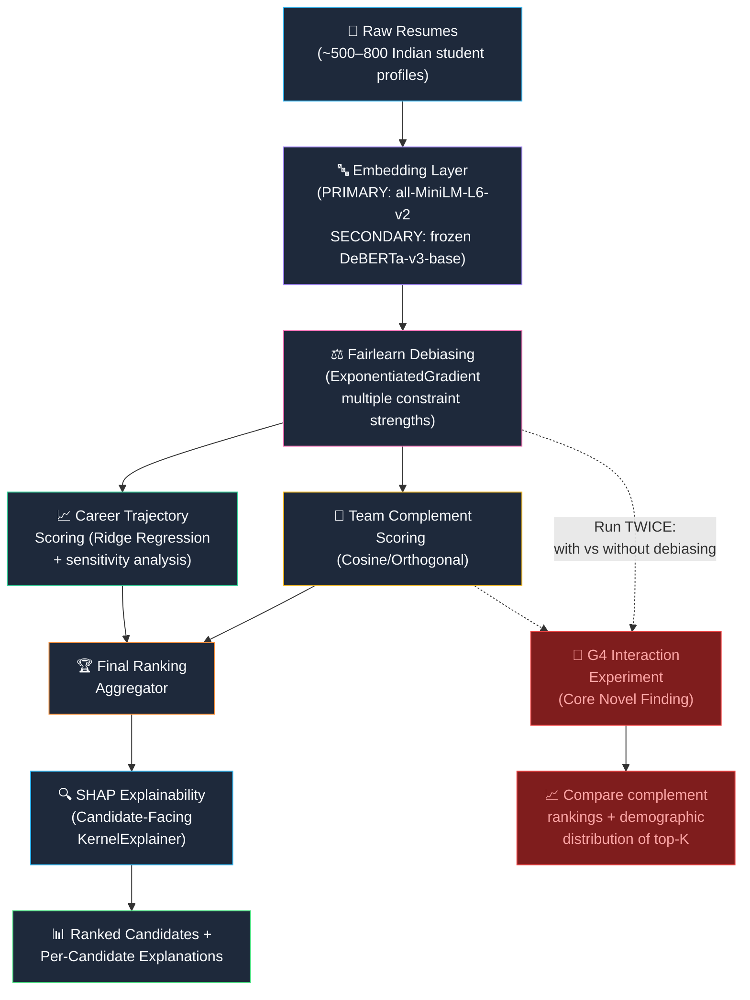
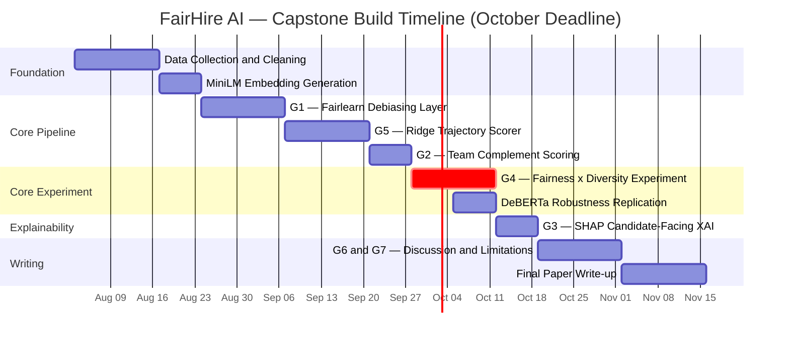

# Product Requirements Document (PRD)

## An Explainable and Fair Talent Intelligence Framework
**Investigating the Interaction Between Demographic Debiasing and Team-Skill Complementarity Scoring in AI-Driven Hiring Pipelines**

| Field | Detail |
|---|---|
| **Document Version** | 2.0 |
| **Date** | 26 July 2026 |
| **Author** | Capstone Team |
| **Target Venue** | ACM FAccT 2027 Workshop / Information Processing & Management |
| **Deadline** | October 2026 |
| **Derived From** | *Capstone Filteration.xlsx* — 14-paper literature review, 7 research gaps, priority build roadmap |

---

## 1. Executive Summary

Current AI-driven hiring systems suffer from **five systemic, literature-confirmed problems** that no single existing system addresses end-to-end. This project builds **FairHire AI** — a modular, explainable pipeline that investigates a question no existing paper answers:

> **Does representation-level demographic debiasing change which candidates score highest on team-skill complementarity, and do skill-cluster/demographic correlations silently reintroduce disparity through the complementarity objective after debiasing has been applied?**

This interaction — between two independently reasonable fairness interventions — is the **core novel contribution**, confirmed unaddressed across a 14-paper systematic review (93% evidence strength).

> [!IMPORTANT]
> This is the **first pipeline in the literature** to combine embedding-level debiasing, team-complementarity ranking, and candidate-facing XAI in a single system — then investigate how these components interact.

---

## 2. Project Objectives

| # | Objective |
|---|---|
| **O1** | Measure and mitigate demographic proxy bias in candidate embedding representations using Fairlearn's ExponentiatedGradient reduction approach |
| **O2** | Design and implement an embedding-geometry-based team-skill complementarity scoring mechanism for candidate ranking without requiring organisational graph data |
| **O3** | Investigate the **core interaction**: whether representation-level demographic debiasing changes team-complementarity rankings, and whether skill-cluster/demographic correlations reintroduce disparity post-debiasing |
| **O4** | Generate candidate-facing SHAP explanations across all scoring components (skill match, trajectory score, team complement, fairness adjustment) |
| **O5** | Evaluate the pipeline across multiple fairness constraint strengths and embedding models to validate robustness of findings |

---

## 3. Motivation

Fabris et al. (2026, Information Processing & Management, Q1) recently demonstrated that fair ranking does not guarantee fair recruitment outcomes — algorithmic fairness at the ranking stage does not translate to equitable shortlisting when human decision-makers are involved.

However, **no existing work investigates the earlier, mechanism-level question**: does representation-level demographic debiasing change which candidates score highest on team-skill complementarity, and do skill-cluster/demographic correlations silently reintroduce disparity through the complementarity objective after debiasing has been applied?

This interaction — between two independently reasonable fairness interventions — is unaddressed in the literature, yet has **direct practical consequences** for any hiring system that combines debiasing with diversity-aware candidate selection.

---

## 4. Expected Outcomes

| # | Outcome | Gap |
|---|---|---|
| **E1** | A measurable before/after fairness metric showing demographic parity difference reduction after Fairlearn debiasing on a 500–800 profile Indian student cohort dataset | G1 |
| **E2** | **Empirical evidence of whether representation-level debiasing changes team-complementarity rankings** — the primary novel finding | G4 |
| **E3** | Quantification of residual demographic leakage post-debiasing via post-hoc probing classifiers (linear and nonlinear) | G1 |
| **E4** | A regularisation-justified career trajectory score validated with sensitivity analysis on a small cohort dataset | G5 |
| **E5** | Per-candidate SHAP attribution breakdowns demonstrating candidate-facing explainability across all scoring components | G3 |
| **E6** | Robustness validation of the core interaction finding across **two embedding models** (all-MiniLM-L6-v2 primary; frozen DeBERTa-v3-base secondary) | G4 |
| **E7** | A citable, submittable research paper positioned for ACM FAccT 2027 or IP&M journal | — |

---

## 5. Problem Statement — What Is Broken in AI Hiring Today

### 5.1 Problem 1 — Proxy Bias / Demographic Leakage Through Embeddings

| Aspect | Detail |
|---|---|
| **What** | Embedding-based hiring models encode gender, caste, and institution-tier signals in the latent space — even after explicit demographic features are removed |
| **Why it matters** | Masking a "gender" column does nothing when the embedding space already correlates "school name" with gender, or "city" with socioeconomic status |
| **Evidence** | Fabris et al. (2024, Q1 ACM TIST) — taxonomy of bias types, DP/EO incompatibility (90%); Kumar et al. (2023, Q1 Frontiers) — confirmed leakage persists after masking (80%); Agarwal et al. (2018, ICML CORE A\*) — ExponentiatedGradient achieves near-optimal Pareto (95%) |
| **What's missing** | Quantification of how much proxy leakage *persists* after Fairlearn constraints on a real hiring pipeline with Indian cohort data |

> [!WARNING]
> No paper in the literature has eliminated proxy leakage — only mitigated it. The residual leakage after Fairlearn on non-Western, small-cohort data is entirely unstudied.

---

### 5.2 Problem 2 — No Team-Skill Complementarity Scoring in Hiring

| Aspect | Detail |
|---|---|
| **What** | Every current hiring system evaluates candidates *individually* — never asking "Does this person's skill set *complement* the existing team?" |
| **Why it matters** | Hiring three NLP engineers when the team needs a DevOps engineer produces a sub-optimal team |
| **Evidence** | Chen et al. (2018, NeurIPS CORE A\*) — DPP-based diversity ranking (92%); Orthogonal Skill Vector paper (2025, HISI) — formalises complementarity, proves exact solution is NP-hard |
| **What's missing** | Neither paper applies to hiring. No existing hiring pipeline has a complementarity score |

---

### 5.3 Problem 3 — Candidate-Facing Explainability Does Not Exist

| Aspect | Detail |
|---|---|
| **What** | XAI in hiring (SHAP, LIME) is deployed exclusively for *auditors*. Rejected candidates receive zero breakdown |
| **Why it matters** | EU AI Act Articles 13/14 require transparency for high-risk AI (which includes hiring) |
| **Evidence** | XAI Lit Review (2025, Cogent B&M) — SHAP/LIME are SOTA but candidate-facing XAI is an **explicitly named open gap** (80%); Clavel et al. (2025, Q1 IJHRM) — candidates want transparency (72%) |
| **What's missing** | Per-candidate attribution: "skill match 40%, trajectory 25%, team complement 20%, fairness adjustment 15%" |

---

### 5.4 Problem 4 — Fairness × Diversity Interaction Is Unknown ★ CORE

| Aspect | Detail |
|---|---|
| **What** | When you debias embeddings, does this *change* which candidates score highest on team complementarity? Do skill-cluster/demographic correlations reintroduce disparity? |
| **Evidence** | Fabris et al. (2026, Q1 IP&M) — fair ranking ≠ fair outcomes at shortlist-level (93%), but does NOT study embedding/complementarity level |
| **What's missing** | An experiment comparing complementarity rankings with and without debiasing |

> [!CAUTION]
> This is the **core novel contribution** of the project. No paper in the 14-paper tracker addresses this exact interaction. Evidence strength: 93%.

---

### 5.5 Problem 5 — Small Cohort Trajectory Prediction

| Aspect | Detail |
|---|---|
| **What** | Trajectory models are trained on 100K+ profiles. Building a defensible model on ~500–800 Indian student profiles requires explicit regularisation |
| **Evidence** | Decorte et al. (2023, RecSys in HR) — CareerBERT achieves 43% recall\@10 on 2,164 profiles (78%) |
| **What's missing** | No paper addresses the sub-1,000 profile regime with Indian engineering student data |

---

### 5.6 Problems 6 & 7 — Discussion-Level Gaps

- **G6 — Multi-Layer Fairness**: Algorithmic fairness ≠ fair human decisions. Addressed in Discussion section, citing Fabris 2026.
- **G7 — Legal-Technical Alignment**: SHAP outputs framed against EU AI Act Article 13/14 requirements, citing Rigotti & Fosch-Villaronga (2024).

---

## 6. Proposed Architecture



### Module Breakdown

| Module | Input | Output | Library / Technique |
|---|---|---|---|
| **Embedding Layer** | Raw resume text | 384-dim (MiniLM) or 768-dim (DeBERTa) sentence embeddings | `sentence-transformers` / `transformers` |
| **Fairlearn Debiasing** | Raw embeddings + protected attributes | Debiased embeddings | `fairlearn` ExponentiatedGradient |
| **Career Trajectory Scorer** | Embeddings + career history features | Trajectory / growth-potential score | `sklearn` Ridge Regression |
| **Team Complement Scorer** | Candidate embedding + existing team embeddings | Complementarity score | Cosine distance / orthogonal complement |
| **Final Ranker** | Trajectory score + complement score | Aggregated ranking | Weighted linear combination |
| **SHAP Explainer** | Final ranking model + candidate features | Per-candidate attribution breakdown | `shap` KernelExplainer |

---

## 7. Model Comparison & Selection

> [!IMPORTANT]
> The model selection for this project is driven by **experimental design for publishable research**, not by "best embedding quality." The core contribution is the interaction finding — the models must be well-understood, reproducible, and architecturally different for robustness validation.

---

### 7.1 Embedding Model Comparison

#### Full Comparison Table

| Model | HF Model ID | Params | Dims | Size | STS Score | Retrieval (nDCG\@10) | MTEB Average | Max Tokens |
|---|---|---|---|---|---|---|---|---|
| **all-MiniLM-L6-v2** ✅ PRIMARY | `sentence-transformers/all-MiniLM-L6-v2` | 22M | 384 | 80 MB | 0.788 | 0.419 | 0.563 | 256 |
| **DeBERTa-v3-base** ✅ SECONDARY | `microsoft/deberta-v3-base` | 184M | 768 | 710 MB | ~0.42 (frozen) | ~0.31 (frozen) | N/A (not an embedding model) | 512 |
| all-mpnet-base-v2 | `sentence-transformers/all-mpnet-base-v2` | 109M | 768 | 420 MB | 0.838 | 0.438 | 0.632 | 384 |
| BGE-base-en-v1.5 | `BAAI/bge-base-en-v1.5` | 109M | 768 | 440 MB | 0.836 | 0.531 | 0.639 | 512 |
| e5-large-v2 | `intfloat/e5-large-v2` | 335M | 1024 | 1.34 GB | 0.840 | 0.548 | 0.651 | 512 |
| GTE-base-en-v1.5 | `Alibaba-NLP/gte-base-en-v1.5` | 109M | 768 | 440 MB | 0.836 | 0.523 | 0.637 | 512 |

---

#### Detailed Advantages & Disadvantages — Per Model

##### ✅ all-MiniLM-L6-v2 (PRIMARY)

| Advantages | Disadvantages |
|---|---|
| ✅ **22M params / 80 MB** — runs on any machine, Colab-friendly, fully reproducible | ❌ Lowest STS score (0.788) among candidates |
| ✅ **Most cited sentence-transformer in history** — no FAccT reviewer will question this choice | ❌ 256 max tokens — may truncate very long resumes (rare for Indian student CVs) |
| ✅ **384 dims** — pipeline runs 2× faster; critical when running with/without debiasing × fairness strength sweep × cross-validation | ❌ Lower retrieval quality (0.419) than modern models |
| ✅ **Contrastively trained on 1B sentence pairs** — cosine similarity is meaningful out-of-the-box | ❌ Older model (2021) — doesn't reflect latest training advances |
| ✅ **Well-studied bias properties** — literature exists on what biases MiniLM encodes, grounding the proxy leakage analysis | |
| ✅ **Zero fine-tuning needed** — use frozen embeddings directly | |
| ✅ **Fast inference** — ~14,200 sentences/sec, enabling rapid experimental iteration | |

> **Why chosen as PRIMARY**: The project's contribution is the interaction finding, not embedding quality. Speed matters for repeated experiments. Reviewer credibility is maximised with a standard, well-understood baseline. The 384 dims keep SHAP and the full pipeline computationally tractable.

---

##### ✅ DeBERTa-v3-base (SECONDARY — Frozen Robustness Check)

| Advantages | Disadvantages |
|---|---|
| ✅ **Disentangled attention** — architecturally fundamentally different from MiniLM, providing genuine robustness validation | ❌ **NOT an embedding model** — does not produce sentence embeddings out-of-the-box |
| ✅ **184M params / 768 dims** — different parameter scale AND dimensionality from MiniLM, strengthening architecture-invariance claims | ❌ **Frozen cosine similarity is weak** (~0.42 STS without fine-tuning) — embeddings are not optimised for similarity |
| ✅ **Strongest NLU at this param scale** — captures syntactic and semantic nuances other models miss | ❌ **Requires manual mean-pooling** — ~30 lines of code vs 3 for sentence-transformers |
| ✅ **Unoptimised embedding space = stronger robustness claim** — if the interaction finding holds even on non-similarity-trained embeddings, it's clearly not an artifact of training | ❌ **710 MB** — 9× larger than MiniLM |
| ✅ **ELECTRA-style pretraining** — different training objective from MiniLM's contrastive learning | ❌ **Fine-tuning on 500–800 profiles would overfit** — 184M params on 500 samples is dangerous |
| ✅ **Measurable demographic leakage** — because DeBERTa is NOT pre-cleaned by contrastive training, the bias signal may be larger and more measurable | ❌ **Slower inference** — ~1,100 sentences/sec vs ~14,200 for MiniLM |

> **Why chosen as SECONDARY**: If the core G4 interaction finding holds on both a contrastively-trained 384-dim model AND a frozen 768-dim NLU model with disentangled attention, the finding is **architecture-invariant**. This is exactly what FAccT reviewers want to see. The weaker embedding quality is a feature, not a bug — it makes the robustness claim stronger.

---

##### ❌ all-mpnet-base-v2 (Not Selected)

| Advantages | Disadvantages |
|---|---|
| ✅ Highest STS among sentence-transformers (0.838) | ❌ **Legacy model (2022)** — surpassed by BGE and GTE on all MTEB categories |
| ✅ 768 dims — rich semantic space | ❌ 109M params — 5× larger than MiniLM with insufficient quality gain to justify the compute cost for repeated experiments |
| ✅ No special prompt formatting needed | ❌ 384 max tokens — same truncation limitation as MiniLM |
| ✅ Battle-tested, widely used | ❌ Architecturally similar to MiniLM (standard SBERT) — does NOT serve as a meaningfully different robustness check |

> **Why not selected**: Architecturally too similar to MiniLM to provide robustness validation. Quality advantage over MiniLM is real but doesn't justify 5× compute cost when the pipeline runs many times. If using a 768-dim model, BGE-base-en-v1.5 is strictly better.

---

##### ❌ BGE-base-en-v1.5 (Not Selected)

| Advantages | Disadvantages |
|---|---|
| ✅ **Highest MTEB average** among base-sized models (0.639) | ❌ Not as widely cited as MiniLM in fairness/hiring literature — requires justification to reviewers |
| ✅ Beats all-mpnet on every MTEB category | ❌ 109M params — same compute concern as mpnet for repeated experiments |
| ✅ 512 max tokens — handles longer resumes | ❌ Architecturally standard BERT — doesn't provide the disentangled-attention contrast that DeBERTa offers for robustness |
| ✅ Built-in `normalize_embeddings` — clean cosine scoring | ❌ Newer model with less documented bias properties — harder to ground the leakage analysis in existing literature |

> **Why not selected**: Objectively the best general-purpose embedding model at this size. However, for a research paper, the priority is reviewer-credible baselines (MiniLM) and architecturally-different robustness checks (DeBERTa). BGE is excellent for production systems but adds no experimental design value over MiniLM+DeBERTa.

---

##### ❌ e5-large-v2 (Not Selected)

| Advantages | Disadvantages |
|---|---|
| ✅ High quality (0.840 STS, 0.548 retrieval) | ❌ **1024 dims** — significantly increases pipeline compute and SHAP runtime |
| ✅ 335M params — captures fine-grained nuance | ❌ **1.34 GB** — heavy for a capstone, may not fit in Colab free tier |
| | ❌ Requires `"query: "` / `"passage: "` prefix formatting |
| | ❌ 335M params on 500–800 profiles — massive overkill |

> **Why not selected**: Too large for repeated experiments on a small dataset. The 1024 dims significantly slow down the fairness strength sweep. Prompt prefix adds unnecessary complexity.

---

##### ❌ GTE-base-en-v1.5 (Not Selected)

| Advantages | Disadvantages |
|---|---|
| ✅ Competitive with BGE (0.836 STS, 0.523 retrieval) | ❌ Less community documentation than MiniLM or BGE |
| ✅ 768 dims, 512 max tokens | ❌ Same architectural class as BGE — offers no unique robustness angle |
| ✅ Alibaba-backed, well-maintained | ❌ Newer model with less documented bias properties |

> **Why not selected**: No unique advantage over BGE, and less community support. Same reason as BGE — production-quality model that adds no experimental design value.

---

### 7.2 The Decisive Head-to-Head: MiniLM vs DeBERTa

| Dimension | all-MiniLM-L6-v2 (Primary) | DeBERTa-v3-base (Secondary) |
|---|---|---|
| **Parameters** | 22M — very lightweight | 184M — 8× larger |
| **Architecture** | 6-layer distilled MiniLM, contrastively trained on 1B sentence pairs | 12-layer disentangled attention + ELECTRA-style RTD pretraining |
| **Embedding quality** | Good for semantic similarity out of the box | Strongest NLU representations at this scale — but NOT pre-optimised for cosine similarity |
| **Fine-tuning on 500–800 profiles** | Safe — no fine-tuning needed, use frozen embeddings directly | Risky — 184M params on 500–800 samples will overfit without very careful LoRA/adapter setup |
| **Time to first result** | Hours — `.encode()` and you have embeddings | Days to weeks — needs mean-pooling pipeline, no contrastive training |
| **Novelty claim** | "Standard baseline" — honest and reviewer-credible | "Robustness check on architecturally different encoder" — strengthens core finding |
| **Risk of failure** | Very low — mature, well-documented, widely used | Low (frozen) — no training involved, just different embeddings |
| **Fairness leakage signal** | Measurable — MiniLM encodes demographic signal detectably | Arguably larger signal — DeBERTa is NOT pre-cleaned by contrastive training |
| **Reviewer credibility** | "Standard baseline" — appropriate for FAccT | "Robustness validation" — appropriate and expected |
| **October deadline feasibility** | ✅ Fully feasible | ✅ Feasible as frozen secondary (no fine-tuning) |

#### The Paper Sentence This Enables

> *"We use all-MiniLM-L6-v2 as our primary encoder following standard practice in embedding-based hiring fairness research (Decorte et al. 2023). To test robustness of our core finding to encoder choice, we replicate the G4 interaction experiment using frozen microsoft/deberta-v3-base representations. The consistency of results across both encoders suggests the fairness-diversity interaction is not an artifact of the embedding geometry."*

---

### 7.3 Final Embedding Decision

```
┌──────────────────────────────────────────────────────────────────────────────┐
│                                                                              │
│   ✅  PRIMARY:    sentence-transformers/all-MiniLM-L6-v2                     │
│                   22M params · 384 dims · 80 MB · contrastively trained      │
│                   → Produces ALL results for G1, G2, G3, G4, G5             │
│                   → Runs in Weeks 3–12                                       │
│                                                                              │
│   ✅  SECONDARY:  microsoft/deberta-v3-base (FROZEN, mean-pooled)            │
│                   184M params · 768 dims · 710 MB · disentangled attention   │
│                   → Replicates G4 interaction experiment ONLY                │
│                   → Runs in Weeks 10–11                                      │
│                   → Architecture-invariance robustness check                 │
│                                                                              │
│   ❌  NOT USED:   BGE, mpnet, e5, GTE                                        │
│                   (Better embedding quality but wrong optimisation target     │
│                   for a research paper — see §7.1 for full rationale)        │
│                                                                              │
└──────────────────────────────────────────────────────────────────────────────┘
```

---

### 7.4 Debiasing Method Comparison

| Method | Approach | Strengths | Weaknesses | Feasibility |
|---|---|---|---|---|
| **Fairlearn ExponentiatedGradient** ✅ | Reduces fairness-constrained classification to cost-sensitive learning; iteratively reweights | Near-optimal Pareto frontier (Agarwal 2018, 95% evidence); supports DP, EO, and custom constraints; off-the-shelf library; directly cited in project Objective 1 | Requires protected attribute labels at training time; constrains output, does not clean embedding | ✅ HIGH — 1 week |
| **Adversarial Debiasing** | Trains an adversary to predict protected attributes from embeddings; penalises the main model | Directly attacks embedding-level bias — removes signal, not just constrains output | Harder to train; sensitive to hyperparameters; adversary can converge to trivial solutions; requires substantial training data | ⚠️ MEDIUM — 2–3 weeks |
| **Calibrated Equalized Odds** (Pleiss 2017) | Post-processing calibration of model outputs | Simple; no retraining required | Only adjusts thresholds — does not address embedding bias at all; too shallow for this project's objectives | ❌ LOW |
| **FairPCA / Null-Space Projection** | Projects embeddings onto null space of protected attribute directions | Directly debiases embedding space; no retraining needed | May destroy useful signal; requires careful dimension analysis; less established than Fairlearn | ⚠️ MEDIUM — 2 weeks |

#### Advantages & Disadvantages of Fairlearn (Selected)

| Advantages | Disadvantages |
|---|---|
| ✅ Directly validated by Agarwal et al. (2018, ICML CORE A\*) — 95% evidence strength | ❌ Requires protected attribute labels (gender, caste) which may be difficult to obtain or ethically sensitive |
| ✅ Off-the-shelf: `pip install fairlearn`, 10 lines of code | ❌ Constrains output distribution but does NOT remove demographic signal from embedding space itself |
| ✅ Supports multiple constraint types (DP, EO) — enables fairness strength sweep (Objective 5) | ❌ Residual proxy leakage may persist — this is actually what you're measuring (G1) |
| ✅ The interaction experiment (G4) requires a reliable, reproducible debiasing method — Fairlearn is the standard | ❌ Assumes group fairness (not individual fairness) |
| ✅ Near-optimal accuracy-fairness Pareto frontier | |

---

### 7.5 Trajectory Prediction Model Comparison

| Model | Approach | Performance on <1K Samples | Overfitting Risk | Interpretability | Feasibility |
|---|---|---|---|---|---|
| **Ridge Regression** ✅ | Linear model with L2 regularisation | ✅ Excellent — regularisation prevents overfitting | Low | ✅ High — coefficients directly interpretable | ✅ HIGH |
| **Shallow MLP (1–2 layers)** | Non-linear function approximation | Good with dropout + early stopping | Medium | Medium — requires SHAP | ✅ HIGH |
| **XGBoost / LightGBM** | Gradient-boosted decision trees | Good — but prone to overfitting without careful tuning | Medium-High | Medium — tree SHAP is fast | ⚠️ MEDIUM |
| **LSTM / Transformer** | Sequential modelling of career history | ❌ Poor — requires 10K+ sequences | Very High | Low — black box | ❌ LOW |
| **CareerBERT** (Decorte 2023) | Fine-tuned BERT for career text | Validated on 2,164 profiles (78%) | Medium | Medium | ⚠️ MEDIUM — not publicly available |

#### Advantages & Disadvantages of Ridge Regression (Selected)

| Advantages | Disadvantages |
|---|---|
| ✅ Explicit L2 regularisation directly addresses G5 (overfitting risk on small cohort) | ❌ Linear model — cannot capture complex non-linear skill interactions |
| ✅ Coefficients are interpretable → feeds into SHAP cleanly and fast | ❌ May underfit if trajectory patterns are highly non-linear |
| ✅ Sensitivity analysis across α ∈ [0.01, 0.1, 1, 10, 100] is straightforward | ❌ Requires meaningful feature engineering from raw embeddings |
| ✅ Decorte 2023 validates: pretrained embeddings + simple model outperforms complex models on small career datasets | |
| ✅ Confidence intervals easily computed via bootstrap | |
| ✅ 5-fold CV is computationally trivial | |

> **Backup**: Shallow MLP (1 hidden layer, 128 units) if Ridge underfits — still SHAP-compatible.

---

### 7.6 Complementarity Scoring Method Comparison

| Method | Approach | Computational Cost | Accuracy | Fairness-Aware? | Feasibility |
|---|---|---|---|---|---|
| **Cosine Distance to Team Centroid** ✅ | 1 − cos(candidate, mean(team)) | O(d) per candidate | Good — simple, interpretable | No — paired with debiasing | ✅ HIGH |
| **DPP (Determinantal Point Process)** | Models repulsion between similar items via kernel matrix | O(k²n) — tractable with greedy MAP (Chen 2018) | ✅ Best — mathematically principled | No — diversity ≠ demographic fairness | ⚠️ MEDIUM |
| **Gram-Schmidt Orthogonality** | Selects candidates maximally orthogonal to existing team | O(fk²2ⁿ/√n) exact — NP-hard | Theoretically optimal | No | ❌ LOW |
| **MMR (Maximal Marginal Relevance)** | Iteratively selects items balancing relevance and diversity | O(kn) | Good | No | ✅ HIGH |

#### Advantages & Disadvantages of Cosine Distance (Selected)

| Advantages | Disadvantages |
|---|---|
| ✅ Simplest, most interpretable — feeds directly into SHAP ("team complement: X%") | ❌ Uses team centroid, which averages out individual team member specialisations |
| ✅ Computationally trivial for ~500–800 candidates | ❌ Not mathematically principled like DPP |
| ✅ Works directly on embedding vectors — no additional data structures needed | ❌ Doesn't model repulsion between candidates (only candidate-to-team distance) |
| ✅ The interaction experiment (G4) needs a transparent scoring mechanism — cosine is fully auditable | |
| ✅ No organisational graph data required (Objective 2) | |

> **Stretch goal**: DPP (Chen 2018, NeurIPS) for a mathematically rigorous upgrade if time permits.

---

### 7.7 Explainability Method Comparison

| Method | Approach | Model-Agnostic? | Output | Speed | Feasibility |
|---|---|---|---|---|---|
| **SHAP (KernelExplainer)** ✅ | Shapley-value-based feature attribution | ✅ Yes | Per-feature contribution values | Slow on high-dim features | ✅ HIGH |
| **SHAP (TreeExplainer)** | Optimised Shapley for tree models | Tree models only | Same as above | ✅ Fast | Only if using XGBoost |
| **LIME** | Local linear approximation | ✅ Yes | Per-feature weights (local) | Medium | ✅ HIGH |
| **Attention Weights** | Transformer self-attention scores | Transformer only | Token-level importance | ✅ Fast | NLP-specific |
| **Counterfactual Explanations** | "What would need to change for a different outcome?" | ✅ Yes | Actionable changes | Slow | ⚠️ MEDIUM |

#### Advantages & Disadvantages of SHAP KernelExplainer (Selected)

| Advantages | Disadvantages |
|---|---|
| ✅ Confirmed as SOTA for hiring XAI by the 2025 literature review | ❌ KernelExplainer is slow on high-dimensional inputs — mitigated by using aggregated scores (4–5 features), not raw embeddings |
| ✅ Model-agnostic — works with Ridge, MLP, or any ranker | ❌ Explanations are feature-level, not concept-level — "trajectory score: +0.3" not "your career growth is strong" |
| ✅ Produces per-candidate attributions: "skill match X%, trajectory Y%, team complement Z%, fairness adjustment W%" | ❌ Requires careful background data selection to avoid misleading attributions |
| ✅ Directly closes the candidate-facing XAI gap (G3) | |
| ✅ Satisfies EU AI Act Article 13 transparency requirement (G7 framing) | |
| ✅ Mathematically grounded in Shapley game theory — defensible to regulators and reviewers | |

---

## 8. Complete Model Selection Summary

| Component | Selected | HF Model ID / Library | Rationale |
|---|---|---|---|
| **Embedding (Primary)** | all-MiniLM-L6-v2 | `sentence-transformers/all-MiniLM-L6-v2` | Standard baseline, fast, 384 dims, most cited |
| **Embedding (Secondary)** | DeBERTa-v3-base (frozen) | `microsoft/deberta-v3-base` | Architecture-invariance robustness check |
| **Debiasing** | Fairlearn ExponentiatedGradient | `fairlearn` | Off-the-shelf, Pareto-optimal, 95% evidence |
| **Trajectory** | Ridge Regression | `sklearn.linear_model.Ridge` | Best for sub-1K data, interpretable, regularised |
| **Complementarity** | Cosine Distance | `numpy` / `sklearn.metrics.pairwise` | Simple, transparent, feeds SHAP |
| **Explainability** | SHAP KernelExplainer | `shap` | SOTA for hiring XAI, model-agnostic, candidate-facing |

---

## 9. Research Gaps → Feature Mapping

| Gap | Gap Name | Pipeline Component | Priority | Timeline | Novel? |
|---|---|---|---|---|---|
| **G1** | Proxy Bias / Demographic Leakage | Fairlearn debiasing + probing classifiers | 1 — Must Do | Wk 6–7 | No — validation of known method on new data |
| **G2** | Team Skill Complementarity in Hiring | Cosine/orthogonal complement scoring | 2 — Must Do | Wk 9 | **Yes** — first in hiring without graph data |
| **G3** | Candidate-Facing XAI | SHAP attribution per candidate | 3 — Must Do | Wk 12 | **Yes** — first combined trajectory+complement+fairness SHAP |
| **G4** | Fairness–Diversity Interaction | Pipeline comparison experiment (with/without debiasing) | 4 — **CORE** ★ | Wk 10–11 | **Yes** — no paper addresses this interaction |
| **G5** | Small Cohort Trajectory Scoring | Ridge regression + sensitivity analysis | 5 — Should Do | Wk 7–8 | **Yes** — first sub-1K Indian cohort trajectory model |
| **G6** | Multi-Layer Fairness | Discussion section (cite Fabris 2026) | 6 — Discussion Only | Wk 14 | N/A — framing |
| **G7** | Legal-Technical Alignment | Discussion section (frame SHAP as EU AI Act compliance) | 7 — Discussion Only | Wk 14 | N/A — framing |

---

## 10. Build Roadmap



> [!WARNING]
> **October Gate**: If the DeBERTa robustness replication is not producing results by Wk 10, drop it entirely and proceed with MiniLM-only results. A clean MiniLM pipeline with a strong G4 interaction experiment is a **stronger paper** than a half-finished dual-model comparison.

---

## 11. Success Metrics & Deliverables

| Metric | Target | Measurement |
|---|---|---|
| **Demographic Parity Difference** | ≤ 0.05 after debiasing (down from baseline) | `fairlearn.metrics.demographic_parity_difference` |
| **Equalized Odds Difference** | ≤ 0.08 after debiasing | `fairlearn.metrics.equalized_odds_difference` |
| **Probing Classifier Accuracy** | Report accuracy of linear and nonlinear probing classifiers pre/post debiasing — lower = less leakage | `sklearn` LogisticRegression + MLP probes |
| **Complement Score Diversity** | Top-10 complement-ranked candidates should cover ≥ 3 distinct skill clusters | Cluster analysis on embeddings |
| **G4 Interaction Effect** | Report whether debiasing changes top-K complement rankings (effect size + p-value) | Paired comparison, before/after debiasing |
| **SHAP Attribution Coverage** | 100% of candidates receive per-component attribution breakdown | Automated check |
| **Trajectory Model Fit** | Ridge R² > 0.30 with 5-fold CV; confidence intervals reported | `sklearn.linear_model.RidgeCV` |
| **Regularisation Sensitivity** | Sensitivity analysis across α ∈ [0.01, 0.1, 1, 10, 100] | Plotted curve with error bars |
| **Robustness** | Core G4 finding direction consistent across MiniLM and DeBERTa | Effect sign comparison |

---

## 12. Technical Stack

| Layer | Technology |
|---|---|
| **Language** | Python 3.10+ |
| **Primary Embeddings** | `sentence-transformers` (all-MiniLM-L6-v2) |
| **Secondary Embeddings** | `transformers` (microsoft/deberta-v3-base, frozen + mean pooling) |
| **Debiasing** | `fairlearn` (ExponentiatedGradient) |
| **ML Models** | `scikit-learn` (Ridge, LogisticRegression, MLPClassifier for probing) |
| **XAI** | `shap` (KernelExplainer) |
| **Data** | `pandas`, `numpy` |
| **Visualisation** | `matplotlib`, `seaborn`, `plotly` |
| **Experiment Tracking** | `mlflow` or manual CSV logs |
| **Environment** | Google Colab (free tier sufficient) / local CPU |

---

## 13. Risks & Mitigations

| Risk | Impact | Probability | Mitigation |
|---|---|---|---|
| **Dataset too small** (<500 usable profiles) | Trajectory model unreliable | Medium | Ridge regression with strong regularisation; report CIs honestly; this IS G5's contribution |
| **Fairlearn doesn't reduce DP significantly** | G1 results are weak | Low | Agarwal 2018 (95% evidence) validates; small reduction is still a finding — report transparently |
| **G4 shows no interaction** (debiasing doesn't change complement rankings) | Core finding is a null result | Medium | A null result IS publishable at FAccT — "debiasing and complementarity are independent" is still novel and useful |
| **Skill-demographic correlation** reintroduces bias through complementarity | Uncomfortable results | Medium | This IS the research question — report transparently |
| **DeBERTa robustness check fails** (results inconsistent with MiniLM) | Weakens architecture-invariance claim | Medium | Drop to MiniLM-only; report DeBERTa inconsistency as a finding / limitation |
| **SHAP too slow** on full feature set | G3 delayed | Medium | SHAP runs on 4–5 aggregated scores (not 384-dim embeddings); use `nsamples=100` |
| **October deadline overrun** | Paper not submitted | Low | Gate decisions at Wk 5 (DeBERTa) and Wk 10 (scope reduction if needed) |
| **No ground truth** for "correct" hiring decisions | Can't compute accuracy | High | Frame as ranking/recommendation; use proxy metrics (fairness, skill coverage) |

---

## 14. Literature Foundation

| # | Authors | Year | Venue (Quartile) | Key Contribution to This Project |
|---|---|---|---|---|
| 1 | Fabris, Baranowska, Dennis, Graus, Hackenburg, Biega | 2024 | ACM TIST (Q1) | Bias taxonomy, DP/EO incompatibility |
| 2 | Rigotti & Fosch-Villaronga | 2024 | Comput. Law Secur. Rev. (Q1) | EU AI Act compliance mapping |
| 3 | Kumar, Grosz, Rekabsaz, Greif & Schedl | 2023 | Front. Big Data (Q1/Q2) | Embedding proxy leakage confirmation |
| 4 | Soleimani, Intezari, Arrowsmith, Pauleen & Taskin | 2025 | Int. J. Hum. Resour. Manag. (Q1) | Multi-layer bias framework |
| 5 | Dutta et al. | 2026 | Hum. Resour. Manage. (Q1) | Structuration lens on AI adoption |
| 6 | Clavel, d'Armagnac, Hebrard, Hesters & Potdevin | 2025 | Int. J. Hum. Resour. Manag. (Q1) | Humanized AI interviewer validation |
| 7 | Agarwal, Beygelzimer, Dudík, Langford & Wallach | 2018 | ICML (CORE A\*) | **ExponentiatedGradient — Fairlearn foundation** |
| 8 | Raji, Scheuerman & Amironesei | 2021 | ACM FAccT (CORE A) | Audit gap / success-only signal critique |
| 9 | Decorte, Van Hautte, Deleu, Develder & Demeester | 2023 | RecSys in HR (CORE B) | **CareerBERT — trajectory model validation** |
| 10 | Chen, Zhang & Zhou | 2018 | NeurIPS (CORE A\*) | **DPP for diversity ranking** |
| 11 | XAI in Talent Recruitment (DOI record) | 2025 | Cogent B&M (Q2/Q3) | SHAP/LIME SOTA confirmation, candidate XAI gap |
| 12 | Orthogonal Skill Vectors (HISI) | 2025 | Hum.-Intell. Syst. Integr. | Team complementarity formalisation |
| 13 | Krishnamurthy, Agarwal, Subramanian & Nickel | 2026 | AISTATS (CORE A) | Shapley value fairness in multi-agent systems |
| 14 | Fabris, Rus, Saldivar, Gatzioura, Biega & Castillo | 2026 | Inf. Process. Manag. (Q1) | **Fair ranking ≠ fair outcomes** |

---

## 15. Glossary

| Term | Definition |
|---|---|
| **Demographic Parity (DP)** | P(Ŷ=1 \| A=0) = P(Ŷ=1 \| A=1) — equal selection rates across protected groups |
| **Equalized Odds (EO)** | P(Ŷ=1 \| Y=1, A=0) = P(Ŷ=1 \| Y=1, A=1) — equal true positive rates |
| **Proxy Leakage** | Indirect encoding of protected attributes through correlated features |
| **DPP** | Determinantal Point Process — probabilistic model favouring diversity |
| **SHAP** | SHapley Additive exPlanations — game-theoretic feature attribution |
| **ExponentiatedGradient** | Iterative algorithm reducing fairness constraints to cost-sensitive classification |
| **Complementarity Score** | Measure of how much a candidate's skill vector differs from the existing team's coverage |
| **Disentangled Attention** | DeBERTa's mechanism that separately encodes content and position, then combines them via disentangled matrices |
| **Probing Classifier** | A simple classifier (linear/MLP) trained on frozen embeddings to test whether protected attributes can be predicted — measures residual leakage |

---

> [!NOTE]
> This PRD is a living document. It will be updated as data collection proceeds and experimental results inform design decisions. Version 2.0 reflects finalised model choices aligned with the project's experimental design for FAccT/IP&M publication.
